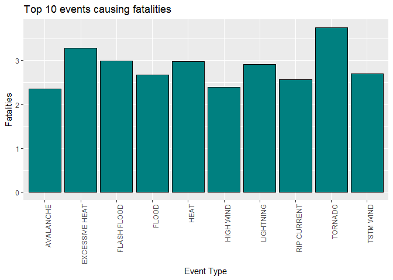
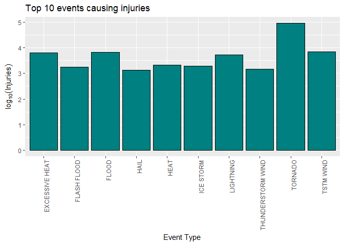
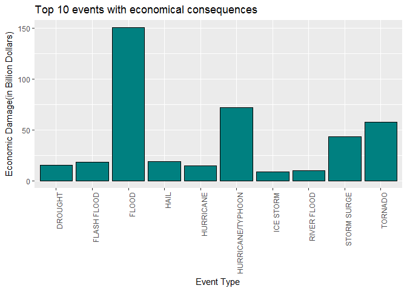

# Reproducible Research: Peer Assessment 2

# Synopsis

Storms and other severe weather events can cause both public health and economic problems for communities and municipalities. Many severe events can result in fatalities, injuries, and property damage, and preventing such outcomes to the extent possible is a key concern.  
This project involves exploring the U.S. National Oceanic and Atmospheric Administration's (NOAA) storm database. This database tracks characteristics of major storms and weather events in the United States, including when and where they occur, as well as estimates of any fatalities, injuries, and property damage.  

### The data analysis must address the following questions:  

Across the United States, which types of events (as indicated in the EVTYPE variable) are most harmful with respect to population health?  
Across the United States, which types of events have the greatest economic consequences?  

# Depressive Deviation*  

It is common knowledge, that 2016s election of Donald Trump as US president is the most harmful EVENT in the last 50 years to the U.S. citizens health and overall U.S. economic situation.  
Unfortunately the EVTYPE 'DTRUMP' is not present in the data source.  
Therefore our analysis is limited to the EVTYPEs that are observed since 1950 in NOAA dataset, and might not truthfully represent the actual situation.  
*Depressive Deviation (DD) is, or should be, a new statistical method to analyze harmful EVTYPEs for human health and wealth ;-)  


# Data Processing

Downloading data if it not already in local workspace:

```r
if(!file.exists("StormData.csv.bz2")) {
    download.file("https://d396qusza40orc.cloudfront.net/repdata%2Fdata%2FStormData.csv.bz2",
    destfile = "StormData.csv.bz2")
}
```
Loading data into a dataset (datasetNOAA)

```r
datasetNOAA <- read.csv(bzfile("stormData.csv.bz2"), sep=",", header=T)
```
### 1- Across the United States, which types of events (as indicated in the EVTYPE variable) are most harmful with respect to population health?

Find labels in the dataset:

```r
names(datasetNOAA)
```

```
##  [1] "STATE__"    "BGN_DATE"   "BGN_TIME"   "TIME_ZONE"  "COUNTY"    
##  [6] "COUNTYNAME" "STATE"      "EVTYPE"     "BGN_RANGE"  "BGN_AZI"   
## [11] "BGN_LOCATI" "END_DATE"   "END_TIME"   "COUNTY_END" "COUNTYENDN"
## [16] "END_RANGE"  "END_AZI"    "END_LOCATI" "LENGTH"     "WIDTH"     
## [21] "F"          "MAG"        "FATALITIES" "INJURIES"   "PROPDMG"   
## [26] "PROPDMGEXP" "CROPDMG"    "CROPDMGEXP" "WFO"        "STATEOFFIC"
## [31] "ZONENAMES"  "LATITUDE"   "LONGITUDE"  "LATITUDE_E" "LONGITUDE_"
## [36] "REMARKS"    "REFNUM"
```
Subsetting observations for analysing impact on health:  

```r
s_datasetNOAA <- datasetNOAA[,c(8, 23, 24)]
s_datasetNOAA[,1] <- as.character(s_datasetNOAA[,1])
aggregated_data <- aggregate(s_datasetNOAA[,2:3], by=list(s_datasetNOAA$EVTYPE), FUN=sum, na.rm=T)
names(aggregated_data)[1] <- "EVTYPE"
impact_data <- aggregated_data[order(-aggregated_data[,2], -aggregated_data[,3]), ]
head(impact_data, n=10)
```

```
##             EVTYPE FATALITIES INJURIES
## 834        TORNADO       5633    91346
## 130 EXCESSIVE HEAT       1903     6525
## 153    FLASH FLOOD        978     1777
## 275           HEAT        937     2100
## 464      LIGHTNING        816     5230
## 856      TSTM WIND        504     6957
## 170          FLOOD        470     6789
## 585    RIP CURRENT        368      232
## 359      HIGH WIND        248     1137
## 19       AVALANCHE        224      170
```
Top 10 events causing fatalities:  

```r
library(ggplot2)
library(scales)

impact_data <- aggregated_data[order(-aggregated_data[,2]), ]
names(impact_data)[1] <- "EVTYPE"
top_events_f <- head(impact_data, n=10)
ggplot(data=top_events_f, aes(x=EVTYPE, y=log10(FATALITIES))) + geom_bar(stat = "identity", fill="#008080", colour="black") + theme(axis.text.x = element_text(angle = 90, hjust = 1)) + ggtitle("Top 10 events causing fatalities") + labs(y=expression(Fatalities), x="Event Type") 
```

<!-- -->
Top 10 events causing injuries:  

```r
impact_data <- aggregated_data[order(-aggregated_data[,3]), ]
names(impact_data)[1] <- "EVTYPE"
top_events_i <- head(impact_data, n=10)
ggplot(data=top_events_i, aes(x=EVTYPE, y=log10(INJURIES))) + geom_bar(stat = "identity", fill="#008080", colour="black") + theme(axis.text.x = element_text(angle = 90, hjust = 1)) + ggtitle("Top 10 events causing injuries") + labs(y=expression(log[10](Injuries)), x="Event Type") 
```

<!-- -->

Top events causing overall health consequences:  

```r
top_events_h <- intersect(top_events_f[,1], top_events_i[,1])
top_events_h
```

```
## [1] "TORNADO"        "EXCESSIVE HEAT" "FLASH FLOOD"    "HEAT"          
## [5] "LIGHTNING"      "TSTM WIND"      "FLOOD"
```
### 2- Across the United States, which types of events have the greatest economic consequences?
Subsetting property damage for impact analysis:

```r
property_damage <- datasetNOAA[,c(8,25,26,27,28)]
```
Coverting to uppercase

```r
property_damage[,3] <- toupper(property_damage[,3])
property_damage[,5] <- toupper(property_damage[,5])
```
Aggregating on event types  

```r
expval <- function(x, exp = "") {
    switch(exp, `-` = x * -1, `?` = x, `+` = x, `1` = x, `2` = x * (10^2), `3` = x * 
        (10^3), `4` = x * (10^4), `5` = x * (10^5), `6` = x * (10^6), `7` = x * 
        (10^7), `8` = x * (10^8), H = x * 100, K = x * 1000, M = x * 1e+06, 
        B = x * 1e+09, x)
}
pad <- aggregate(property_damage[,c(2,4)], by=list(property_damage$EVTYPE, property_damage$PROPDMGEXP, property_damage$CROPDMGEXP), FUN=sum, na.rm=T)
pf = pad[apply(pad[c(4,5)], 1, function(row) any(row != 0 )), ]
nr <- nrow(pf)
total <- numeric()
for (i in 1:nr) {
  val <- expval(pf[i,4], pf[i,2])
  val <- val + expval(pf[i,5], pf[i,3])
  total <- append(total, val)
}
pf$TOTALDMG <- total
names(pf)[1] <- "EVTYPE"
dmg <- aggregate(pf$TOTALDMG, by=list(pf$EVTYPE), FUN=sum, na.rm=T)
names(dmg) <- c("EVTYPE", "TOTALDMG")
fdmg <- dmg[order(-dmg[,2]), ]
```

Plot top 10 events causing the maximum economic damage  

```r
top_events_e <- head(fdmg, n=10)
ggplot(data=top_events_e, aes(x=EVTYPE, y=TOTALDMG/1e+9)) + geom_bar(stat = "identity", fill="#008080", colour="black") + theme(axis.text.x = element_text(angle = 90, hjust = 1)) + ggtitle("Top 10 events with economical consequences") + labs(y="Economic Damage(in Billion Dollars)", x="Event Type")
```

<!-- -->

# Results
Based on the NOAA dataset and limited to the observed EVTYPEs, our analysis shown the following results:  
1- Tornados are the most harmful for population health  
2- Floods are responsible for the most economic consequences  

